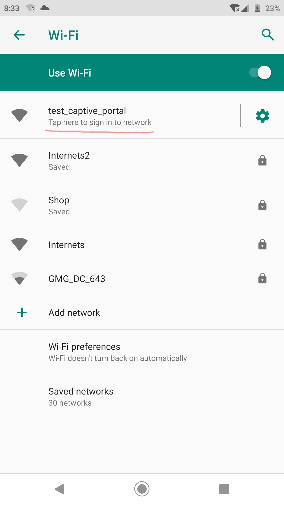

## Purpose
As an amateur, I don't know what I'm doing most of the time.  When I set out to do this, all I knew was I wanted my device to automatically redirect users to a page after they connect to it's wifi network, just like airports and hotels do.  Turns out this is called a captive portal.  I struggled for awhile to get this to work, so I'll try to point out what does what in this example.

One (ab)use case for this is for projects that use a web page for configuration.  Normally you need to navigate to that page with the IP address in a browser... which means you have to write it down somewhere, or print it on a display (if you have one), or my next best idea: print a QR code with a hyperlink to it.  It is better if we can redirect the device right to the page we want without fussing around.

## How it works... I think
Modern devices (windows, android, probably apple) and web browsers like to check to see if a newly connected WIFI network has internet access.  They reach out to some known location, and if they get the right response, decide to stay connected and do their thing.  Luckily there is a behavior on these devices designed to send you to a network sign-on page if it doesn't get the reply it was hoping for, and that's what this takes advantage of.  Basically:
1. When the device boots it has an IP address, default is 192.168.4.1 on the ESP32
2. A DNS server is started, and it is configured to direct *all* traffic to that IP address
3. We take advantage of the "not found" behavior of the web server and send whatever we want as a response to the original request
4. The device thinks it's going to network sign-on page - this is where we get to send it where we want - for example a configuration or remote control page for the device.
5. Bingo, now it is easy to get to where you wanted in the first place, without having to type in the IP address

## Hardware
An ESP32, nothing else.  Easiest way is to use one of the dev boards available on amazon/ebay/whatever.  It may be necessary to power it externally, as some modules have power issues over USB and may trigger the brownout detector when activating wifi.
This is probably applicable to the ESP8266, or anything else using these libraries.

## Toolchain and Libraries
I am using VS Code and Platform.io.  Should also work with the Arduino IDE as long as you add the required libraries.
Builtin libraries: wifi.h, dnsserver.h
Other libraries:
- AsyncTCP: https://github.com/OttoWinter/AsyncTCP
- ESPAsyncWebServer: https://github.com/esphome/ESPAsyncWebServer

## Notes
- Works great with windows 10, you get to use your regular web browser
- Android devices take you to the page, but it may be in the embedded web browser instead of your usual one

### Apple
- Haven't figured out how to properly redirect IOS devices, but at least they (it - sample size of 1) are happy to stay connected
- Some hours of googling haven't revealed a great way to do this, there are scattered discussions around, but nothing amazing
- I liked the "success is the key to success" note from this thread: https://www.esp8266.com/viewtopic.php?f=34&t=4398
 so I went ahead and followed that advice.  Need to test without it to see if it actually made a difference

### Acknowledgements
Thanks to other humans that shared info about this already.  I'm not doing anything new, but just trying to explain things in a way that makes sense to me...
- https://www.esp8266.com/viewtopic.php?f=34&t=4398
- https://github.com/me-no-dev/ESPAsyncWebServer/blob/master/examples/CaptivePortal/CaptivePortal.ino
- https://iotespresso.com/create-captive-portal-using-esp32/

